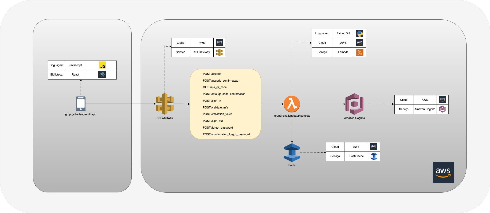

# CHALLENGE AUTH LAMBDA

Micro serviço responsável por realizar toda comunicação entre o amazon cognito e o api gateway que servirá de porta de entrada para as aplicações clientes verificarem a autorização de acesso

## Localização na arquitetura

## Requisitos:

#### 1 - Precisa ter o docker instalado na máquina
#### 2 - Baixe as collections (Postman) da api no diretório ./collection

## Iniciar o serviço:

#### 1 - Para executar basta clicar com o botão direito em cima do arquivo ./infra/start.sh dentro da plataforma de uma IDE (pycharm ou intellij) e em seguida selecionar o run

#### 2 - Aguarde os containers subirem

#### 3 - Abra o endereço do diretorio ./infra/localstack/output/endpoint.json e copie o gateway_id localizado no meio da URL (Exemplo: Para o endereço -> http://localhost:4566/restapis/ry7gsx5a51/test/_user_request_/, o gateway_id será ry7gsx5a51)                  

#### 4 - Altere a variável gateway_id da environment baixada das collections (Postman) com o valor obtido no passo 2.                  

#### 5 - Agora você poderá começar a fazer suas requisições

## Parar o serviço:

#### Para encerrar basta clicar com o botão direito em cima do arquivo ./infra/stop.sh dentro da plataforma de uma IDE (pycharm ou intellij) e em seguida selecionar o run

